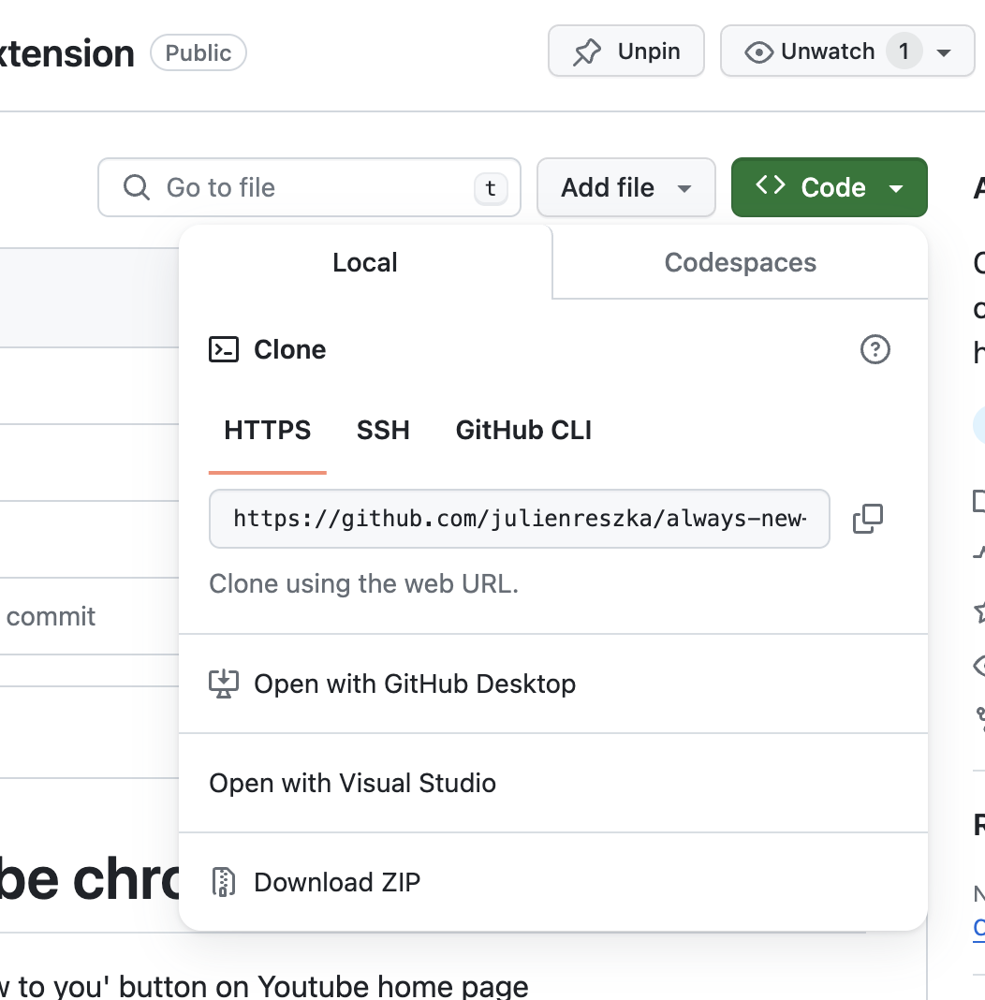
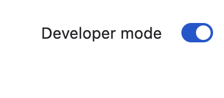
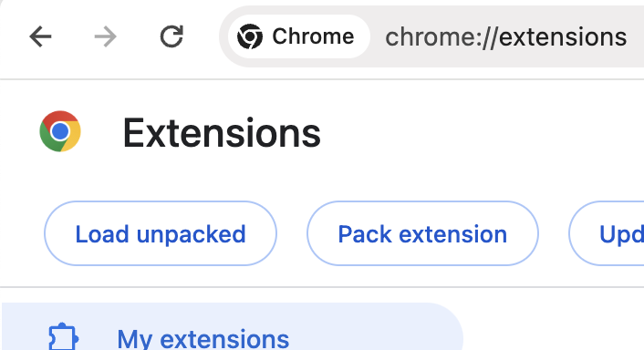

# Always New to you youtube chrome extension

Chrome extension that automatically clicks on 'New to you' button on Youtube home page

## Purpose

YouTube's recommendation system is based on your viewing habits, comparing them with similar users to suggest content you might enjoy. However, this can often lead to a repetitive cycle of similar content. The 'New to You' Chrome extension breaks this cycle, always introducing you to new content that you might not have discovered otherwise.

## Features

- Automatically clicks on 'New to you' button on Youtube home page

## Installation

### Download

Either:

1. Clone this repository to your local machine
2. Go to the instruction to [Load the extension](#load-the-extension)

Or If you don't know how to clone

1. Click on the green button with "< > code" to open the dropdown 
2. Click on "Download ZIP"
3. Extract the zip file to a folder on your local machine
4. Go to the instruction to [Load the extension](#load-the-extension)

### Load the extension

Once you have the extension folder on your local machine

1. Open Chrome and navigate to `chrome://extensions`.
2. Enable Developer mode by clicking the toggle switch at the top right. 
3. Click the `Load unpacked` button and select the extension directory. 

## Usage

1. Open Youtube home page
2. Enjoy
